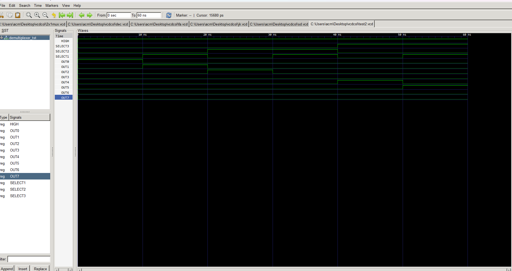

###1x8 Demultiplexer VHDL Implementation

## Overview
This VHDL code implements a 1x8 demultiplexer, which takes a single input signal (`A`) and directs it to one of eight output lines based on the control signals (`S2`, `S1`, `S0`). This README provides an explanation of the code structure and functionality.

## Files
- **demux.vhdl**: Contains the VHDL code for the demultiplexer.
- **demux_tb.vhdl**: This file, providing documentation for the VHDL implementation.

## Code Explanation

### Entity Declaration
## Markdown Explanation of Demultiplexer VHDL Code

This markdown file explains the VHDL code for a 4-to-1 demultiplexer.

**Code Summary:**

The code defines a VHDL entity named `demultiplexer` and its corresponding architecture named `de_arc`. The entity has four input ports (`A`, `S2`, `S1`, and `S0`) and eight output ports (`D7`, `D6`, `D5`, `D4`, `D3`, `D2`, `D1`, and `D0`). The architecture maps specific combinations of input values to the corresponding output signals.

**Input Ports:**

- `A`: The data signal to be demultiplexed.
- `S2`, `S1`, `S0`: The select signals that determine which output receives the data.

**Output Ports:**

- `D7` to `D0`: The eight output signals, where only one will be active at a time depending on the select signals.

**Functionality:**

The code uses logical expressions to control the activation of each output. Each expression combines the data signal (`A`) with the select signals (`S2`, `S1`, and `S0`) using AND and NOT operators. An output becomes active only when its corresponding expression evaluates to TRUE.

**Specific Output Activation:**

- `D7`: Activated when `S2`, `S1`, and `S0` are all `'1'` and `A` is `'1'`.
- `D6`: Activated when `S2` and `S1` are `'1'`, `S0` is `'0'`, and `A` is `'1'`.
- And so on, following the same logic for each output based on the different combinations of select signals.

**Key Points:**

- The code implements a 4-to-1 demultiplexer, meaning it selects one out of four data lines based on the control signals.
- The select signals determine which output receives the data by activating the corresponding expression.
- Each output can only be active at one time because the expressions are mutually exclusive.

**Additional Notes:**

- This code assumes `STD_LOGIC` data types for all signals.
- The code could be made more concise by using a `case` statement instead of individual expressions.
- Error handling for invalid input combinations might be needed in practical applications.

# 1x8 Demultiplexer

