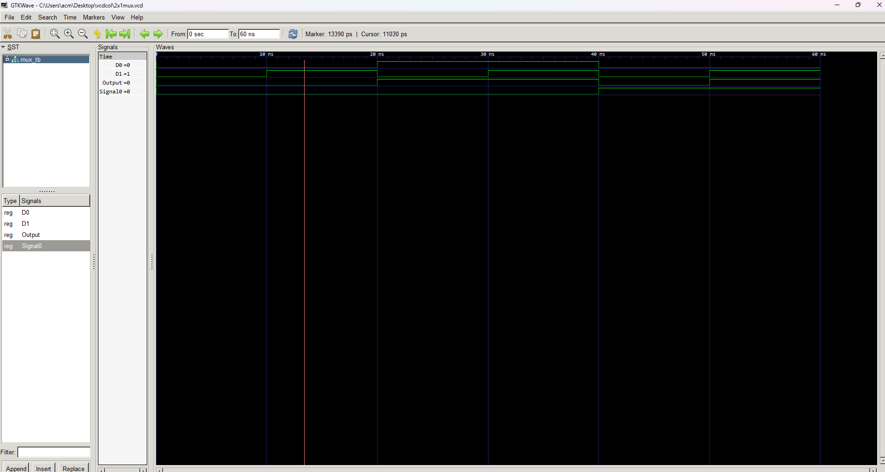

## Explanation of VHDL Code for a 2-to-1 Multiplexer

This file explains the VHDL code for a 2-to-1 multiplexer, a combinational circuit that selects one of two input signals based on a control signal.

**Entity and Architecture:**

- The entity named `mux` has three input ports: `A0`, `A1` (data inputs) and `S0` (select control), and one output port: `Y` (selected output).
- The corresponding architecture named `mux_arc` implements the logic using a single process.

**Functionality:**

The multiplexer operates based on the following rule:

- If `S0` is low (`'0'`), the output `Y` is assigned the value of `A0`.
- If `S0` is high (`'1'`), the output `Y` is assigned the value of `A1`.

**Truth Table:**

| S0 | A0 | A1 | Y |
|---|---|---|---|
| 0 | 0 | 0 | 0 |
| 0 | 0 | 1 | 0 |
| 0 | 1 | 0 | 1 |
| 0 | 1 | 1 | 1 |
| 1 | 0 | 0 | 0 |
| 1 | 0 | 1 | 1 |
| 1 | 1 | 0 | 1 |
| 1 | 1 | 1 | 1 |

**Key Points:**

- The multiplexer is a fundamental building block in digital circuits for data selection.
- The VHDL code uses conditional expressions to implement the selection logic.
- The code assumes `STD_LOGIC` data types for all signals.

**Additional Notes:**

- Error handling for invalid control signals might be needed in practical applications.
- Alternative implementations using case statements or explicit assignments are possible.

I hope this markdown explanation clarifies the VHDL code for the 2-to-1 multiplexer. Feel free to ask if you have any further questions!

# 2X1 MUX

