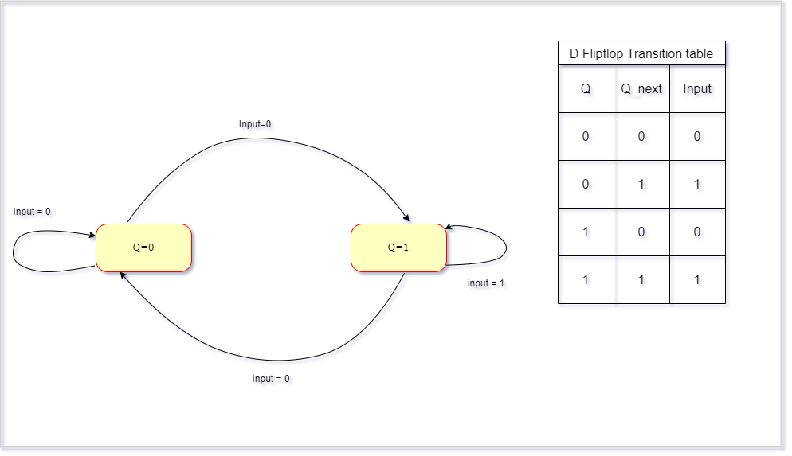
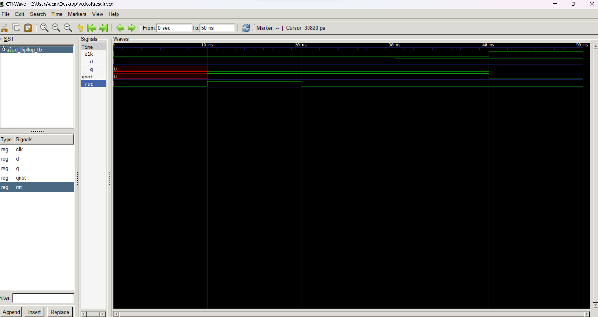

##Explanation of D-Flipflop VHDL Code

This markdown file explains the VHDL code for a D-flipflop, a fundamental sequential circuit that stores a single bit of data.

**Code Summary:**

The code defines a VHDL entity named `D_flipflop` and its corresponding architecture named `behaviour`. The entity has four ports:

- `D`: Input data to be stored.
- `CLK`: Clock signal that triggers data capture.
- `RST`: Reset signal that initializes the flipflop.
- `Q`: Output representing the stored data.
- `Qnot`: Negated output of `Q`.

**Functionality:**

The flipflop operates in two main stages:

- **Reset:** When `RST` is high (`'1'`), the output `Q` is forced to low (`'0'`) and `Qnot` is forced to high (`'1'`), regardless of the data input (`D`). This initializes the flipflop to a known state.
- **Data Capture:** On the **rising edge** of the `CLK` signal (when it transitions from low to high), the current value of `D` is captured and stored in `Q`. Simultaneously, the negated value (`not D`) is stored in `Qnot`.

**Key Points:**

- The D-flipflop is an edge-triggered sequential circuit, meaning data capture happens only on specific clock transitions.
- The `rising_edge` function detects the rising edge of the clock signal.
- The flipflop remembers the captured data until the next valid clock edge or reset.
- `Q` and `Qnot` always provide complementary outputs.

**Additional Notes:**

- This code assumes `STD_LOGIC` data types for all signals.
- The code could be made more concise using a `case` statement instead of an `if` statement.
- Error handling for invalid clock or reset signals might be needed in practical applications.

I hope this markdown explanation clarifies the D-flipflop VHDL code. Feel free to ask if you have any further questions!

# D FlipFlop state diagram

# D FlipFlop Waveform

