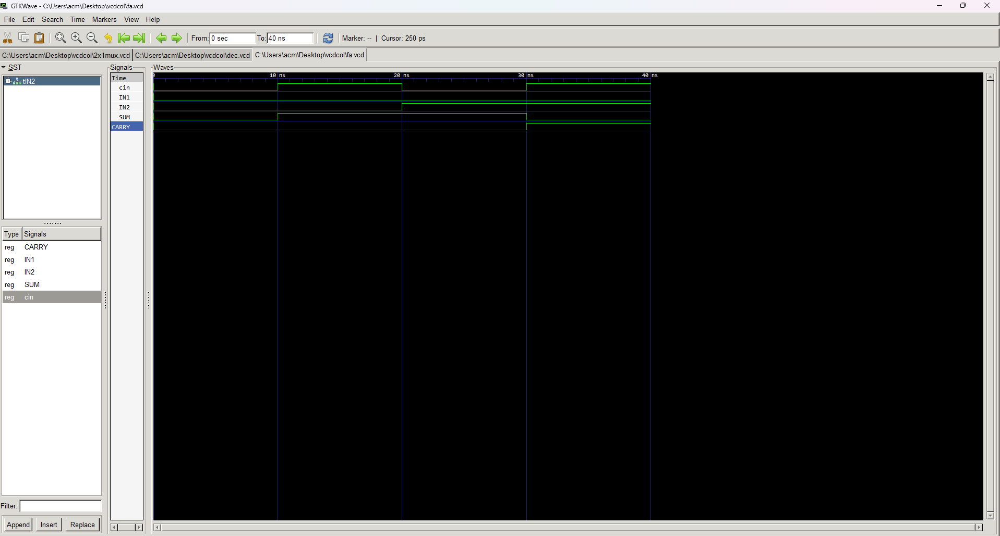

# Explanation of VHDL Code for a Full Adder

This markdown file explains the VHDL code for a full adder circuit, constructed using a structural model with half adders and an OR gate.

**Code Structure:**

The code consists of three entities and their corresponding architectures:

1. **OR Gate (`or_gate`):**
   - Implements a basic OR gate with two inputs (`x`, `y`) and one output (`z`).
   - Architecture (`or_arc`) directly assigns the OR operation result to the output.

2. **Half Adder (`half_adder`):**
   - Implements a half adder with two inputs (`a`, `b`) and two outputs (`s`, `c`).
   - Architecture (`half_arc`) calculates the sum (`s`) using XOR and the carry-out (`c`) using AND.

3. **Full Adder (`full_adder`):**
   - Implements a full adder with three inputs (`A`, `B`, `Cin`) and two outputs (`S`, `Cout`).
   - Architecture (`fa_arc`) utilizes instances of `half_adder` and `or_gate` to achieve full addition.

**Full Adder Functionality:**

- The full adder combines two half adders and an OR gate to perform addition of three bits.
- **Internal Signals:**
   - `S1`: Intermediate sum from the first half adder.
   - `C1`: Carry-out from the first half adder.
   - `C2`: Carry-out from the second half adder.
- **Steps:**
   1. **First Half Adder (`HA1`):** Adds `A` and `B` to produce `S1` and `C1`.
   2. **Second Half Adder (`HA2`):** Adds `S1` and `Cin` to produce the final sum `S` and `C2`.
   3. **OR Gate (`OR1`):** Combines the carry-outs (`C1` and `C2`) to generate the final carry-out `C`.

**Key Points:**

- The full adder is a fundamental building block in digital arithmetic circuits.
- Structural modeling allows for hierarchical design using reusable components.
- The code demonstrates a clear and concise implementation of a full adder using VHDL.

**Additional Notes:**

- The code assumes `STD_LOGIC` data types for all signals.
- Error handling for invalid input combinations might be needed in practical applications.
- Alternative implementations using behavioral modeling or a single-process architecture are possible.

# FULLADDER

