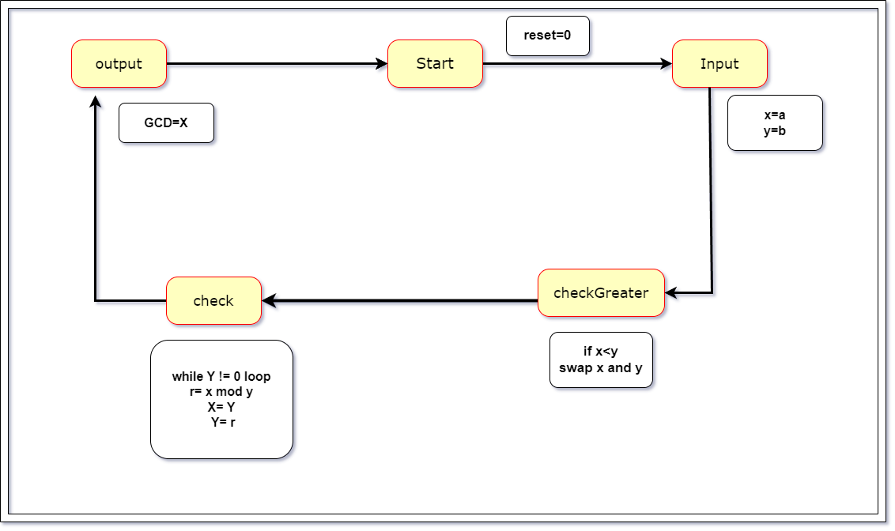
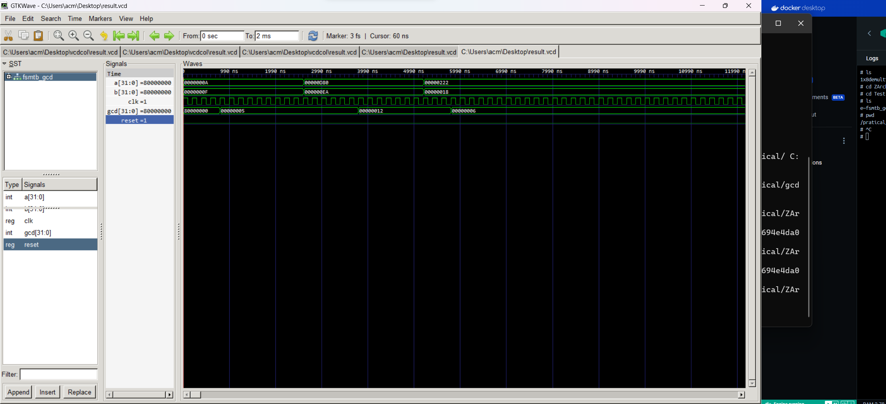

 ## Explaination the VHDL code for a GCD calculator using the Euclidean algorithm.

**Entity and Architecture:**

- The entity named `gcd` has input ports for `RESET`, `CLK`, `A`, and `B` (two integers) and an output port for `GCD` (integer).
- The corresponding architecture named `gcdarc` implements the logic using two processes: `state_register` and `compute`.

**State Machine:**

- A state machine with six states (`start`, `input`, `output`, `check`, `check1`, `updatex`, `updatey`) controls the data flow.
- The `state_register` process updates the current state based on the clock and reset signals.
- The `compute` process performs the actual GCD calculation based on the current state and input values.

**Data Flow and Algorithm:**

1. **Start:** Upon reset or initial power-up, the state transitions to `start`.
2. **Input:** The `A` and `B` values are stored in internal variables `x` and `y`. The state moves to `check`.
3. **Check:** If `x` is less than `y`, the state changes to `updatex`. Otherwise, it goes to `updatey`.
4. **Check1:** A `while` loop iterates until `y` becomes 0, performing modular division (`mod`) to eliminate multiples of the smaller value. The state then moves to `output`.
5. **UpdateX/UpdateY:** Swaps the values of `x` and `y` (only in `updatex`) to maintain the larger value in `x`.
6. **Output:** The calculated GCD (`x`) is stored in the output port, and the state returns to `start`.
7. **Others:** If an invalid state is encountered, the state reverts to `start`.

**Key Points:**

- The code implements the Euclidean algorithm for GCD calculation.
- A finite state machine controls the data flow and state transitions.
- Internal variables like `r` and `p` are used for intermediate calculations.

**Additional Notes:**

- The code assumes integer data

# Greatest Common Divisior state diagram

# Greatest Common Divisior

