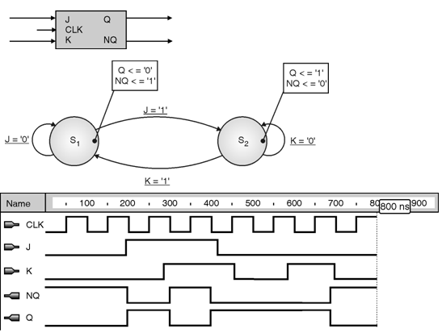
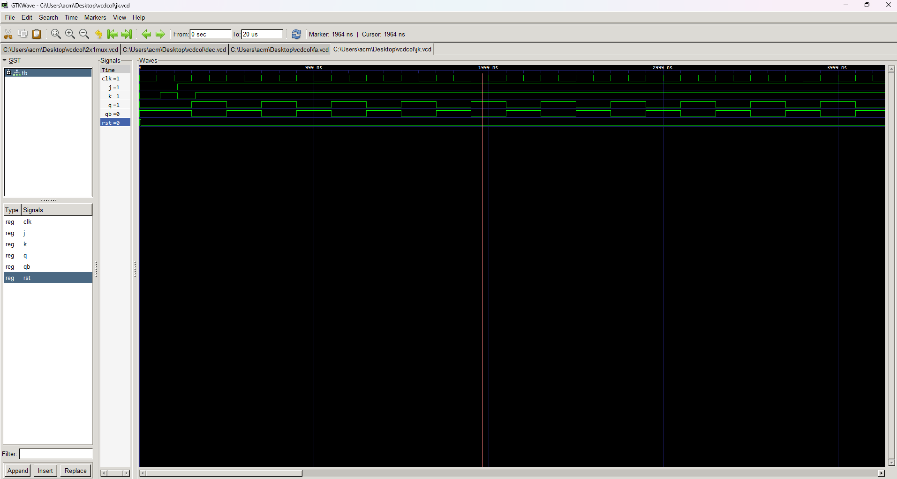

##Explanation of VHDL Code for JK Flip-Flop

This markdown file explains the VHDL code for a JK flip-flop, a versatile sequential circuit that stores one bit of data.

**Entity and Architecture:**

- The entity named `jk` has input ports for `J` (set), `K` (reset), `CLK` (clock), `RST` (reset), and output ports for `Q` (output) and `Qb` (complementary output).
- The corresponding architecture named `jk_arc` implements the logic using a single process.

**Functionality:**

The JK flip-flop operates based on the following rules:

- **Preset and Clear:** When `RST` is high (`'1'`), the output `Q` is forced to low (`'0'`). This initializes the flip-flop regardless of other inputs.
- **Clocked Data Capture:** On the **rising edge** of the `CLK` signal (when it transitions from low to high):
    - If `J` and `K` are different (`J /= K`), the output `Q` follows the value of `J`.
    - If both `J` and `K` are high (`'1'`), the output `Q` inverts its current value (`not output`).
    - Otherwise, the output remains unchanged.
- **Complementary Output:** The `Qb` output always provides the negation of `Q`.

**Key Points:**

- The JK flip-flop is an edge-triggered sequential circuit.
- The `rising_edge` function detects the rising edge of the clock signal.
- The flip-flop remembers the captured data until the next valid clock edge or reset.
- `Q` and `Qb` provide complementary outputs.

**Additional Notes:**

- This code assumes `STD_LOGIC` data types for all signals.
- The code could be made more concise using multiple processes or case statements.
- Error handling for invalid clock or reset signals might be needed in practical applications.

# jk flipflop state diagram

# jk flipflop
