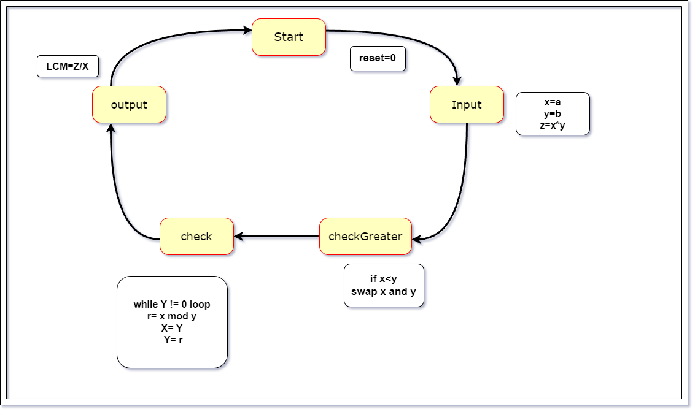
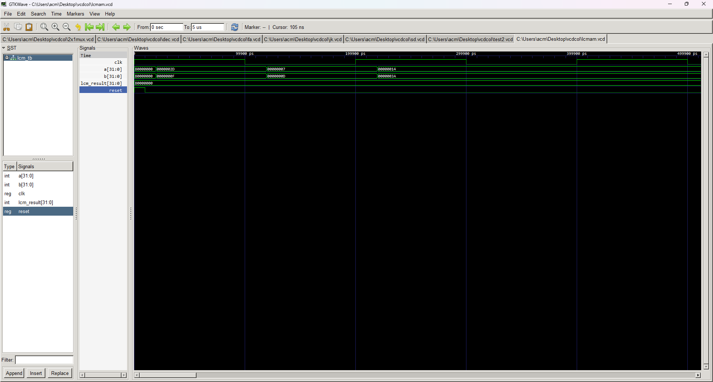

## Explanation of VHDL Code for Least Common Multiple (LCM) Calculator

This markdown  explains the VHDL code for an LCM calculator using a similar approach to the GCD calculator you saw earlier.

**Entity and Architecture:**

- The entity named `lcm` has input ports for `RESET`, `CLK`, `A`, and `B` (two integers) and an output port for `LCM` (integer).
- The corresponding architecture named `lcmarc` implements the logic using two processes: `state_register` and `compute`.

**State Machine:**

- A state machine with six states (`start`, `input`, `output`, `check`, `check1`, `updatex`, `updatey`) controls the data flow.
- It's very similar to the state machine used in the GCD calculator with minor differences in state transitions and calculations.

**Data Flow and Algorithm:**

1. **Start:** Upon reset or initial power-up, the state transitions to `start`.
2. **Input:** The `A` and `B` values are stored in internal variables `x` and `y`. The initial `LCM` value is calculated as `x * y` and stored in `z`. The state moves to `check`.
3. **Check:** Similar to GCD, if `x` is less than `y`, the state changes to `updatex`. Otherwise, it goes to `updatey`.
4. **Check1:** A `while` loop iterates until `y` becomes 0, performing modular division (`mod`) to eliminate multiples of the smaller value, similar to the GCD calculation.
5. **UpdateX/UpdateY:** Swaps the values of `x` and `y` (only in `updatex`) to maintain the larger value in `x`.
6. **Output:** The final `LCM` is calculated as `z / x` (since `z` holds the initial product) and stored in the output port. The state returns to `start

# Lowest Common Multiple state diagram

# Lowest Common Multiple
