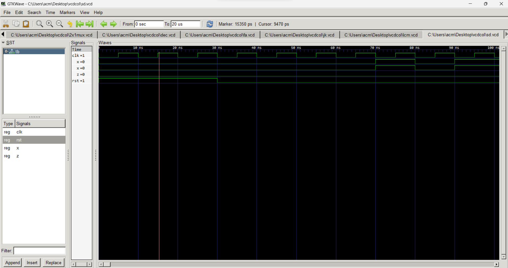

##Explanation of VHDL Code for State Detector (SD)

This file explains the VHDL code for a state detector circuit, which identifies specific input sequences.

**Entity and Architecture:**

- The entity named `sd` has input ports for `CLK` (clock), `RST` (reset), `X` (data input), and an output port for `Z` (detected state).
- The corresponding architecture named `sdarc` implements the logic using three processes: `seq_proc`, `comb_proc`, and `out_proc`.

**Finite State Machine (FSM):**

- The circuit uses an FSM with five states (`Q0`, `Q1`, `Q2`, `Q3`, `Q4`) to track the input sequence.
- The `seq_proc` process updates the current state based on the clock and reset signals.
- The `comb_proc` process determines the next state based on the current state and the `X` input.

**State Transitions and Detection:**

- The FSM transitions through states based on the input `X` and current state.
- Specific input sequences are detected as follows:
    - "1" sequence: `Q0` -> `Q1`
    - "10" sequence: `Q1` -> `Q2`
    - "101" sequence: `Q2` -> `Q3`
    - "1011" sequence: `Q3` -> `Q4`
    - Any other sequence: `Q4` -> `Q0` (resets)
- The `out_proc` process assigns the output `Z` based on the current state:
    - `Z = 1` only when in state `Q4`, indicating detection of the "1011" sequence.
    - Otherwise, `Z = 0`.

**Key Points:**

- The code implements a state detector using a VHDL FSM.
- The state transitions and output logic depend on specific input sequences.
- The code assumes `STD_LOGIC` data types for all signals.

**Additional Notes:**

- Error handling for invalid input sequences might be needed in practical applications.
- Alternative implementations using a single process or different state encoding are possible.

# Sequence Detection

