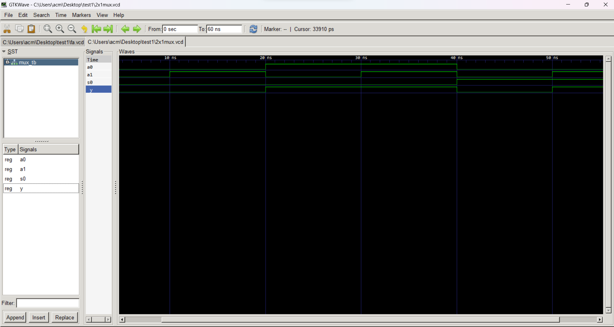

## Markdown Explanation of VHDL Code for a Structural 2-to-1 Multiplexer

This explains the VHDL code for a 2-to-1 multiplexer implemented using structural modeling with basic logic gates.

**Entity and Architecture:**

- The entity named `MUX_STRUCTURAL` has three input ports: `a`, `b` (data inputs), `sel` (select control), and one output port: `y` (selected output).
- The corresponding architecture named `structural` implements the logic by instantiating and connecting multiple instances of lower-level logic gates.

**Building Blocks:**

- Three components are declared: `OR_GATE`, `AND_GATE`, and `NOT_GATE`, representing the basic logic functions.

**Data Flow and Multiplexing:**

1. **Signal Declaration:** The architecture declares temporary signals to store intermediate results: `and_out1`, `and_out2`, `or_out`, and `not_out`.
2. **NOT Gate:** The `not1` instance inverts the `sel` signal, storing the result in `not_out`.
3. **AND Gates:**
    - `and1` performs an AND operation between `a` and `not_out`, storing the result in `and_out1`.
    - `and2` performs an AND operation between `b` and `sel`, storing the result in `and_out2`.
4. **OR Gate:** The `or1` instance performs an OR operation between `and_out1` and `and_out2`, storing the final multiplexed output in `or_out`.
5. **Output Assignment:** The `y` output port is assigned the value of `or_out`.

**Key Points:**

- The multiplexer is built using lower-level logic gates, demonstrating structural modeling.
- The control signal is inverted before the AND gate to achieve correct multiplexing behavior.
- The code follows a hierarchical approach, breaking down the design into smaller components.

**Additional Notes:**

- This approach can be less efficient than behavioral modeling for larger circuits.
- Error handling might be needed if invalid control signals are applied.
- Alternative implementations using different gate combinations are possible.

# 2x1 Multiplexer using Structural Modeling

